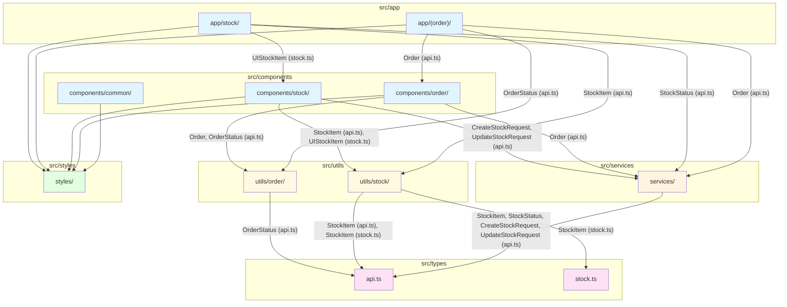

# Mr-Daebak-Staff 프로젝트 아키텍처 다이어그램

## 컴포넌트 패키지 구성도

## 디렉토리별 인터페이스 사용

### src/app/

- `app/(order)/` → `api.ts`, `components/order/`, `services/`, `utils/order/`
- `app/stock/` → `api.ts`, `components/stock/`, `services/`, `utils/stock/`

### src/components/

- `components/common/` → `styles/`
- `components/stock/` → `api.ts`, `stock.ts`, `services/`, `utils/stock/`, `styles/`
- `components/order/` → `api.ts`, `services/`, `utils/order/`, `styles/`

### src/services/

- `services/` → `api.ts`, `client.ts`

### src/types/

- `api.ts` → API 응답/요청 타입 정의 (Order, OrderStatus, StockItem, StockStatus, CreateStockRequest, UpdateStockStatusRequest, UpdateStockRequest 등)
- `stock.ts` → UI용 재고 타입 정의 (StockItem UI)

### src/utils/

- `utils/stock/` → `api.ts`, `stock.ts`
- `utils/order/` → `api.ts`

### src/styles/

- `styles/` → 테마 설정, Emotion 타입 정의

## 데이터 흐름

1. **페이지 레벨** (`app/`)

   - 사용자 인터랙션 처리
   - 상태 관리 (useState, useEffect)
   - 서비스 호출

2. **컴포넌트 레벨** (`components/`)

   - UI 렌더링
   - 이벤트 핸들링
   - 서비스 호출 (필요시)

3. **서비스 레벨** (`services/`)

   - API 통신
   - 에러 처리
   - 데이터 변환 (필요시)

4. **유틸리티 레벨** (`utils/`)

   - 데이터 변환 (Adapter)
   - 비즈니스 로직 (Helpers, Filters)

5. **타입 레벨** (`types/`)
   - 타입 안정성 보장
   - API와 UI 타입 분리
