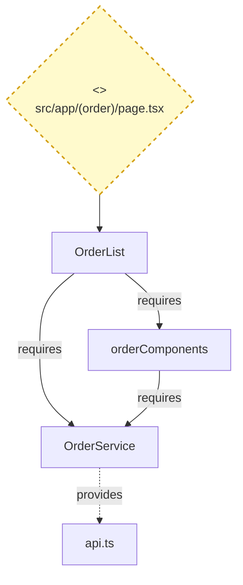
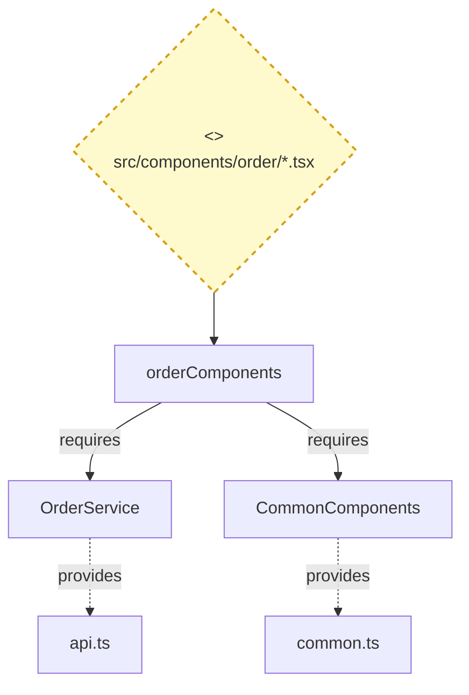
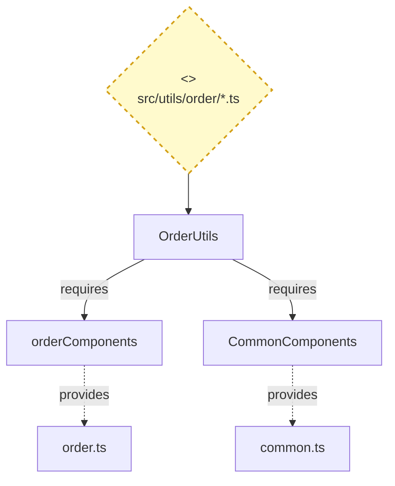
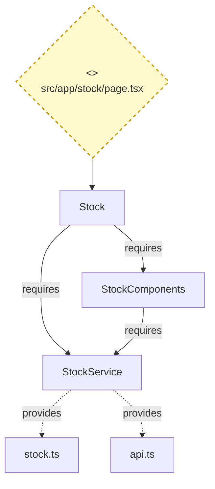
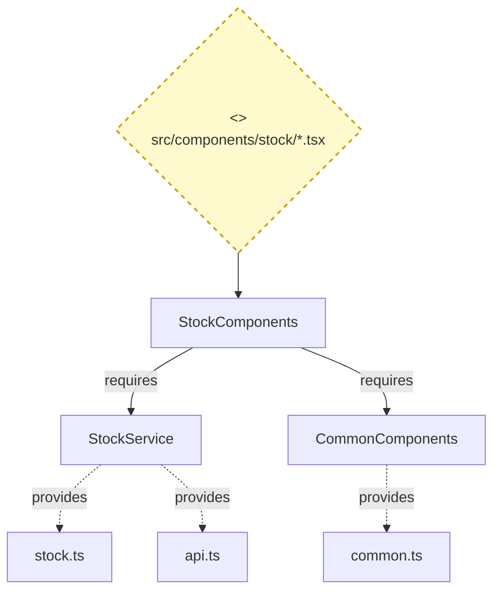
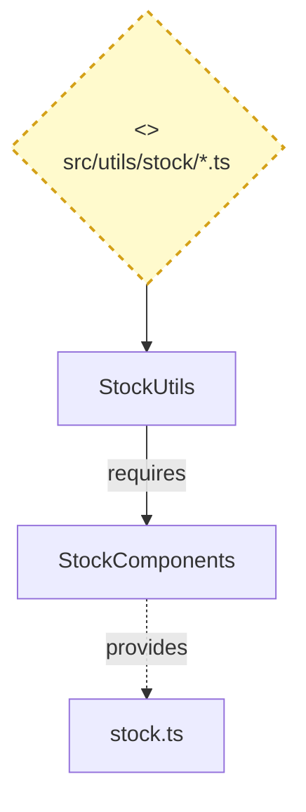
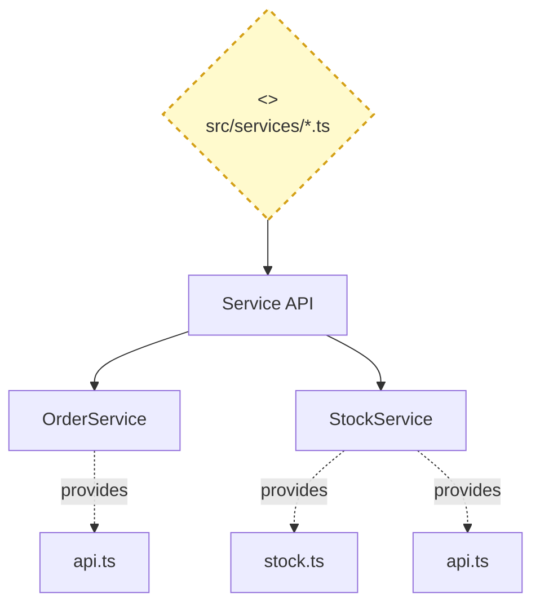
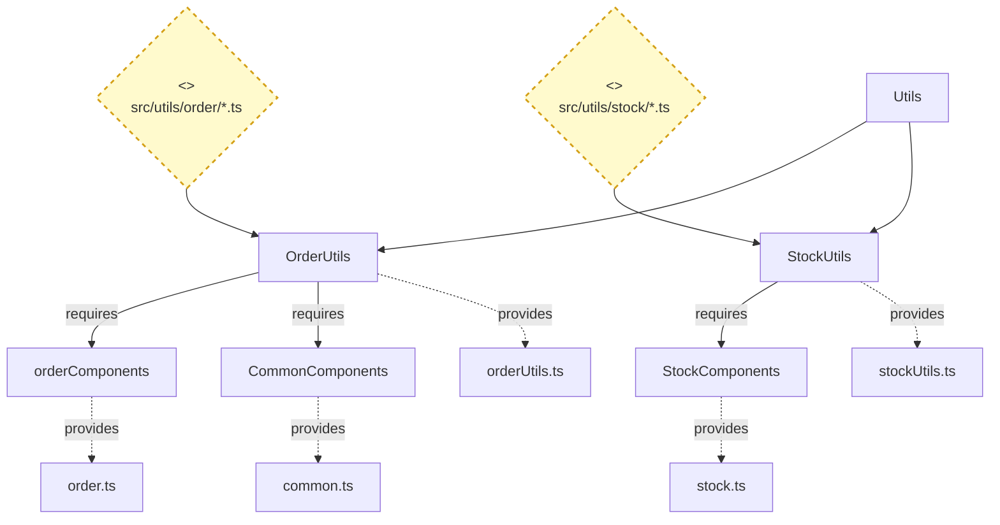
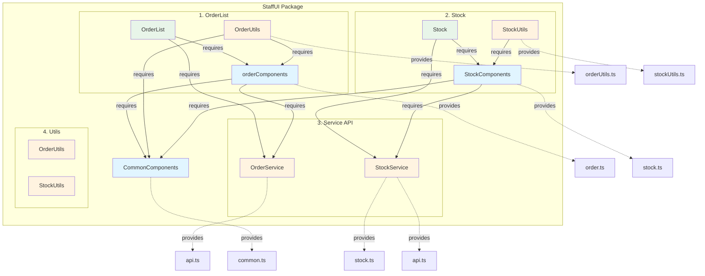
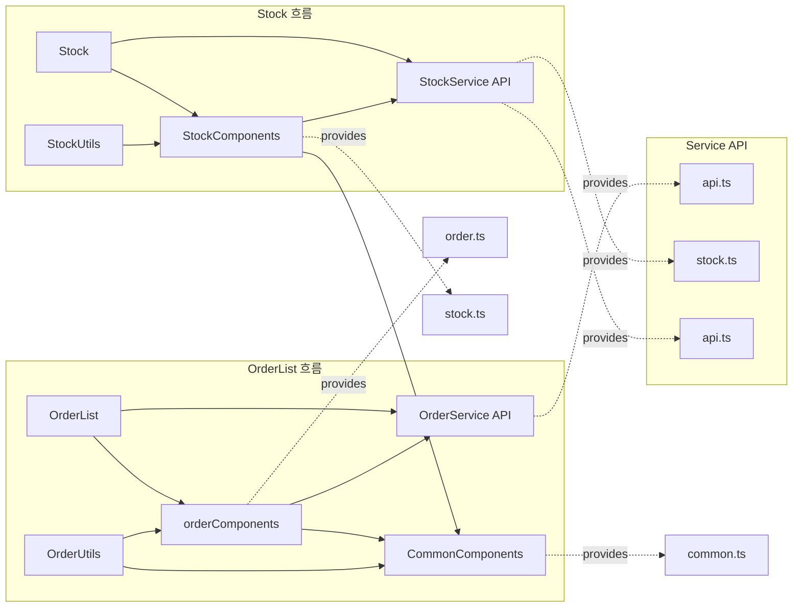

# StaffUI 컴포넌트 클래스 실현 파일

이 문서는 StaffUI 패키지 내 컴포넌트들의 클래스 실현(Class Implementation)을 정의합니다.

COMPONENT_ARCHITECTURE.md에 나타난 모든 컴포넌트를 4개의 주요 그룹으로 재구성하여 인터페이스 제공 및 필요 관계를 명시합니다.

---

## 1. OrderList 컴포넌트

**역할**: 주문 목록 관리 기능을 제공하며, 처리중(progress)과 완료(done) 상태의 주문을 표시하고 관리한다.

**인터페이스 의존성**:

- 필요한 인터페이스: OrderService의 `api.ts`, orderComponents

### 1-1. orderComponents

**역할**: 주문 관련 UI 컴포넌트를 제공하며, OrderListSidebar, OrderDetail 등의 주문 표시 및 상세 정보 컴포넌트를 포함한다.

**인터페이스 의존성**:

- 제공하는 인터페이스: `order.ts` (IOrderComponents 인터페이스)

- 필요한 인터페이스: OrderService의 `api.ts`, CommonComponents의 `common.ts`

### 1-2. OrderUtils

**역할**: 주문 관련 유틸리티 함수를 제공하며, 주문 필터링, 상태 변환, 헬퍼 함수 등의 기능을 포함한다.

**인터페이스 의존성**:

- 제공하는 인터페이스: `orderUtils.ts` (IOrderUtils 인터페이스)

- 필요한 인터페이스: orderComponents의 `order.ts`, CommonComponents의 `common.ts`

---

## 2. Stock 컴포넌트

**역할**: 재고 관리 기능을 제공하며, 재고 현황 조회, 재고 수량 관리, 판매 상태 변경 등의 기능을 포함한다.

**인터페이스 의존성**:

- 필요한 인터페이스: StockService의 `stock.ts`, `api.ts`, StockComponents

### 2-1. StockComponents

**역할**: 재고 관련 UI 컴포넌트를 제공하며, StockTable, StockStats, AddStockModal, StockManageModal 등의 재고 표시 및 관리 컴포넌트를 포함한다.

**인터페이스 의존성**:

- 제공하는 인터페이스: `stock.ts` (IStockComponents 인터페이스)

- 필요한 인터페이스: StockService의 `stock.ts`, `api.ts`, CommonComponents의 `common.ts`

### 2-2. StockUtils

**역할**: 재고 관련 유틸리티 함수를 제공하며, 재고 데이터 어댑터, 재고 상태 계산, 헬퍼 함수 등의 기능을 포함한다.

**인터페이스 의존성**:

- 제공하는 인터페이스: `stockUtils.ts` (IStockUtils 인터페이스)

- 필요한 인터페이스: StockComponents의 `stock.ts`

---

## 3. Service (API) 컴포넌트

**역할**: API 통신 서비스를 제공하며, HTTP 클라이언트 설정 및 API 엔드포인트 호출 기능을 포함한다.

**인터페이스 의존성**:

- 제공하는 인터페이스: `api.ts` (IOrderService 인터페이스), `stock.ts` (IStockService 인터페이스), `api.ts` (IStockService 인터페이스)

### 3-1. OrderService (API)

**역할**: 주문 관련 API 서비스를 제공하는 컴포넌트로, 주문 목록 조회, 주문 승인/거절, 주문 상태 변경 등의 API 호출을 담당한다.

**인터페이스 의존성**:

- 제공하는 인터페이스: `api.ts` (IOrderService 인터페이스)

- 사용처: OrderList, orderComponents

### 3-2. StockService (API)

**역할**: 재고 관련 API 서비스를 제공하는 컴포넌트로, 재고 목록 조회, 재고 수량 업데이트, 재고 상태 변경 등의 API 호출을 담당한다.

**인터페이스 의존성**:

- 제공하는 인터페이스: `stock.ts` (IStockService 인터페이스), `api.ts`

- 사용처: Stock, StockComponents

---

## 4. Utils 컴포넌트

**역할**: 유틸리티 함수들을 제공하는 컴포넌트로, OrderUtils와 StockUtils를 포함한다.

**인터페이스 의존성**:

- 제공하는 인터페이스: `orderUtils.ts` (IOrderUtils 인터페이스), `stockUtils.ts` (IStockUtils 인터페이스)

### 4-1. OrderUtils

**역할**: 주문 관련 유틸리티 함수를 제공하며, 주문 필터링, 상태 변환, 헬퍼 함수 등의 기능을 포함한다.

**인터페이스 의존성**:

- 제공하는 인터페이스: `orderUtils.ts` (IOrderUtils 인터페이스)

- 필요한 인터페이스: orderComponents의 `order.ts`, CommonComponents의 `common.ts`

### 4-2. StockUtils

**역할**: 재고 관련 유틸리티 함수를 제공하며, 재고 데이터 어댑터, 재고 상태 계산, 헬퍼 함수 등의 기능을 포함한다.

**인터페이스 의존성**:

- 제공하는 인터페이스: `stockUtils.ts` (IStockUtils 인터페이스)

- 필요한 인터페이스: StockComponents의 `stock.ts`

---

## 전체 컴포넌트 관계도

---

## 인터페이스 제공/필요 관계 요약

### 제공하는 인터페이스 (Provides / Lollipop)

- **OrderList 그룹**:

  - orderComponents → `order.ts` (IOrderComponents 인터페이스)
  - OrderUtils → `orderUtils.ts` (IOrderUtils 인터페이스)

- **Stock 그룹**:

  - StockComponents → `stock.ts` (IStockComponents 인터페이스)
  - StockUtils → `stockUtils.ts` (IStockUtils 인터페이스)

- **Service (API)**:

  - OrderService → `api.ts` (IOrderService 인터페이스)
  - StockService → `stock.ts` (IStockService 인터페이스), `api.ts`

- **Utils 그룹**:

  - OrderUtils → `orderUtils.ts` (IOrderUtils 인터페이스)
  - StockUtils → `stockUtils.ts` (IStockUtils 인터페이스)

- **CommonComponents**:
  - CommonComponents → `common.ts` (ICommonComponents 인터페이스)

### 필요로 하는 인터페이스 (Requires / Socket)

- **OrderList 그룹**:

  - OrderList → `api.ts` (from OrderService), orderComponents
  - orderComponents → `api.ts` (from OrderService), `common.ts` (from CommonComponents)
  - OrderUtils → `order.ts` (from orderComponents), `common.ts` (from CommonComponents)

- **Stock 그룹**:

  - Stock → `stock.ts`, `api.ts` (from StockService), StockComponents
  - StockComponents → `stock.ts`, `api.ts` (from StockService), `common.ts` (from CommonComponents)
  - StockUtils → `stock.ts` (from StockComponents)

- **Service (API)**: 없음

- **Utils 그룹**:
  - OrderUtils → `order.ts` (from orderComponents), `common.ts` (from CommonComponents)
  - StockUtils → `stock.ts` (from StockComponents)

---

## 주요 의존성 흐름

